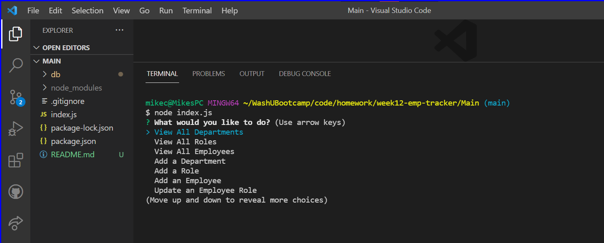
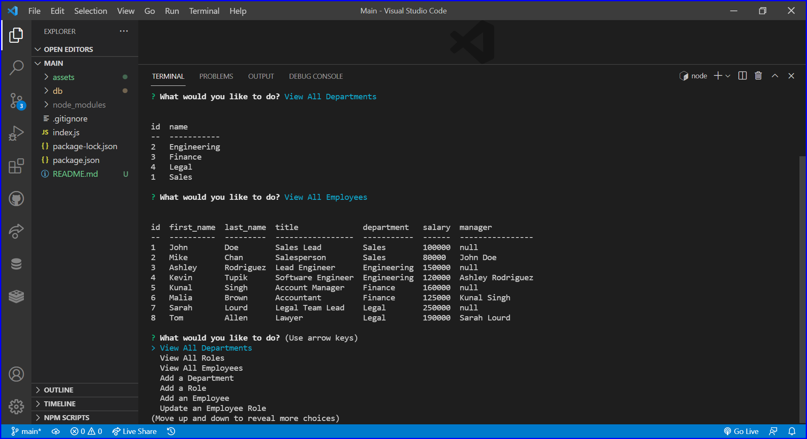

# Employee Tracker

## Table of Contents

I. [Description](#description)  
II. [Install Instructions](#install-instructions)  
III. [Usage Information](#usage-information)  
IV. [Contribution Guidelines](#contribution-guidelines)  
V. [Testing Instructions](#testing-instructions)  
VI. [Questions / Contact](#contact)  
VII. [License](#license)

## <a id="description">I. Description</a>

An app that allows you to look at a database of employees, departments and roles. Also let you add new departments / roles / employees, or update an employees role.

## <a id="install-instructions">II. Install Instructions</a>

Fork it, clone it, from the terminal 'npm i' will install the Inquirer, MySQL2 and console.table packages.

## <a id="usage-information">III. Usage Information</a>

In the terminal, from root folder, run with the command 'node index'

### Project Screenshot

### Credits

This NodeJS project uses <a href="https://www.npmjs.com/package/inquirer" target="_blank">Inquirer</a> for terminal interface, <a href="https://www.npmjs.com/package/mysql2" target="_blank">mysql2</a> to connect to the database, and <a href="https://www.npmjs.com/package/console.table" target="_blank">console.table</a> to render the data to the terminal in a table format.

## <a id="contribution-guidelines">IV. Contribution Guidelines</a>

Contact me to contribute!

## <a id="testing-instructions">V. Testing Instructions</a>

No tests exist for this project

## <a id="contact">VI. Questions / Contact</a>

If you have any questions, or want to contribute to this or any other project feel free to contact me.

### email

ChampionMike42@gmail.com

### GitHub

<a href="https://github.com/MikeChampion" target="_blank">MikeChampion @ Github</a>

## <a id="license">VII. License</a>

Copyright 2021 Mike Champion
 
        
Permission is hereby granted, free of charge, to any person obtaining a copy of this software and associated documentation files (the "Software"), to deal in the Software without restriction, including without limitation the rights to use, copy, modify, merge, publish, distribute, sublicense, and/or sell copies of the Software, and to permit persons to whom the Software is furnished to do so, subject to the following conditions:

        
The above copyright notice and this permission notice shall be included in all copies or substantial portions of the Software.

        
THE SOFTWARE IS PROVIDED "AS IS", WITHOUT WARRANTY OF ANY KIND, EXPRESS OR IMPLIED, INCLUDING BUT NOT LIMITED TO THE WARRANTIES OF MERCHANTABILITY, FITNESS FOR A PARTICULAR PURPOSE AND NONINFRINGEMENT. IN NO EVENT SHALL THE AUTHORS OR COPYRIGHT HOLDERS BE LIABLE FOR ANY CLAIM, DAMAGES OR OTHER LIABILITY, WHETHER IN AN ACTION OF CONTRACT, TORT OR OTHERWISE, ARISING FROM, OUT OF OR IN CONNECTION WITH THE SOFTWARE OR THE USE OR OTHER DEALINGS IN THE SOFTWARE.

